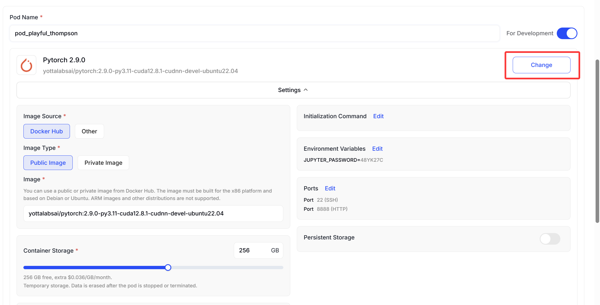
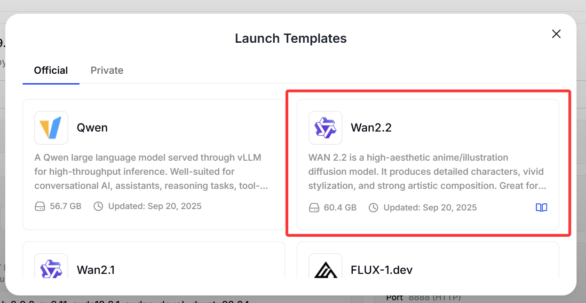
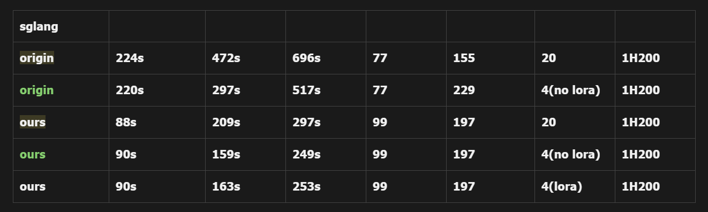

# SGLang Animate For WAN2.2: Acceleration 
[**Paper**](https://arxiv.org/abs/2602.06036) | [**Blog**](https://z-lab.ai/projects/dflash/) | [**Models**](https://huggingface.co/collections/z-lab/dflash)

We support **Wan2.2 animate** on **SGLang** and make some acceleration on Wan2.2 so that achieve faster speed.
<br>

<div align="center">
  
</div>


https://github.com/user-attachments/assets/18635538-56f0-4a0a-9027-bfe0a7da71ec


<br>

## 📦 Function Support Plan

### ✅ Supported
- **Animate-Inference-No-replace**

### 🚧 Coming Soon
- **Animate-Inference-replace**  
- **Animate-Inference-retarget**  


> 💡 Feel free to open a GitHub issue if you’d like to request support for additional models!  


<br>

## 🚀 Quick Start

### Installation
```bash
sudo apt install python3.10-venv -y
python3 -m venv .venv
source .venv/bin/activate

git checkout new_no_replace
pip install --upgrade pip
pip install -r requirements.txt
pip install -e "python[diffusion]"

# Optionally install flash-attn.
# If unavailable, evaluation falls back to torch.sdpa in the Transformers backend.
# The measured speedup will be slower, but the acceptance length remains comparable.

# uv pip install flash-attn --no-build-isolation
```

## Use Yotta Platform
We have deployed a ready-to-use edition on [Yotta Labs](https://docs.yottalabs.ai/yotta-labs/products/gpu-pods)
For a simpe start, you can use it through the following steps:
<div align="center">
  
</div>
<div align="center">
  
</div>

### Model Download
```bash
huggingface-cli login --token <secret>
huggingface-cli download Wan-AI/Wan2.2-Animate-14B --local-dir ./Wan2.2-Animate-14B
huggingface-cli download black-forest-labs/FLUX.1-Kontext-dev --local-dir ./FLUX.1-Kontext-dev
# for FLUX, you need to agree the Acceptable Use Policy first on hugging face first.

mv ./FLUX.1-Kontext-dev ./Wan2.2-Animate-14B/process_checkpoint
#lora下载
huggingface-cli download lightx2v/Wan2.1-I2V-14B-720P-StepDistill-CfgDistill-Lightx2v \
  --local-dir ./Wan2.1-I2V-14B-720P \
  --local-dir-use-symlinks False
```

### SGLang
For no replace
```bash
sglang generate \
  --model-path Wan-AI/Wan2.2-Animate-14B-Diffusers \
  --prompt='People in the video are doing actions.' \
  --image-path ./tmp/process_results/src_ref.png \
  --pose-video-path ./tmp/process_results/src_pose.mp4 \
  --face-video-path ./tmp/process_results/src_face.mp4 \
  --width  1280 --height 720 --save-output
```
For replace
```bash
sglang generate \
  --model-path Wan-AI/Wan2.2-Animate-14B-Diffusers \
  --prompt='People in the video are doing actions.' \
  --image-path ./tmp/process_results/src_ref.png \
  --pose-video-path ./tmp/process_results/src_pose.mp4 \
  --face-video-path ./tmp/process_results/src_face.mp4 \
  --bg-video-path ./tmp/process_results/src_bg.mp4 \
  --mask-video-path ./tmp/process_results/src_mask.mp4 \
  --width 1280 --height 720 --save-output --replace-flag
```


## 📊 Evaluation
We provide **Adaptive Dynamic Frame Segmentation** and **Thread-Pool-Based Concurrent Scheduling** to accelerate the total generation speed. The reported results were tested on NVIDIA H200 or AMD MI300x GPUs.

<div align="center">
  
</div>
For more details, Please see [here](https://github.com/shiqi-svg/sglang_wan-animate/blob/new_no_replace/blog.md)

## **Acknowledgement**

Huge thanks to [@dcw02](https://github.com/dcw02), [@gongy](https://github.com/gongy), and the other folks at [@modal-labs](https://github.com/modal-labs) for the fast, high-quality support in bringing DFlash into SGLang—making it possible to truly accelerate LLM serving in real-world deployments.

